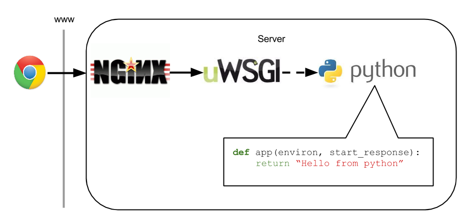

# Nginx-uWSGI-Python

Configuration example to execute Python scripts via CGI through Nginx and uWSGI application server.

Execution model:

    http[s]://<dns_prefix>.<domain>/<python_script>    ---->    Nginx (reverse proxy)    ---->    uWSGI (CGI)

## Description of included files

* `/nginx/XX-dns_prefix.conf` => Nginx VHost template
* `/python_scripts/deploy.py` => Example Python script to execute
* `/python_scripts/uwsgi` => uWSGI binary compiled through `curl http://uwsgi.it/install | bash -s cgi <abs_path_to_python_scripts_dir>/uwsgi` command
* `/python_scripts/uwsgi.ini`=> uWSGI configuration file
* `/systemd/uwsgi.service` => Systemd service file for the uWSGI instance responsible for executing the Python scripts

## Related Links

* [Running CGI scripts on uWSGI](https://uwsgi-docs.readthedocs.io/en/latest/CGI.html)
* [Setting up Nginx and uWSGI for CGI scripting](http://raspberrywebserver.com/cgiscripting/setting-up-nginx-and-uwsgi-for-cgi-scripting.html)
